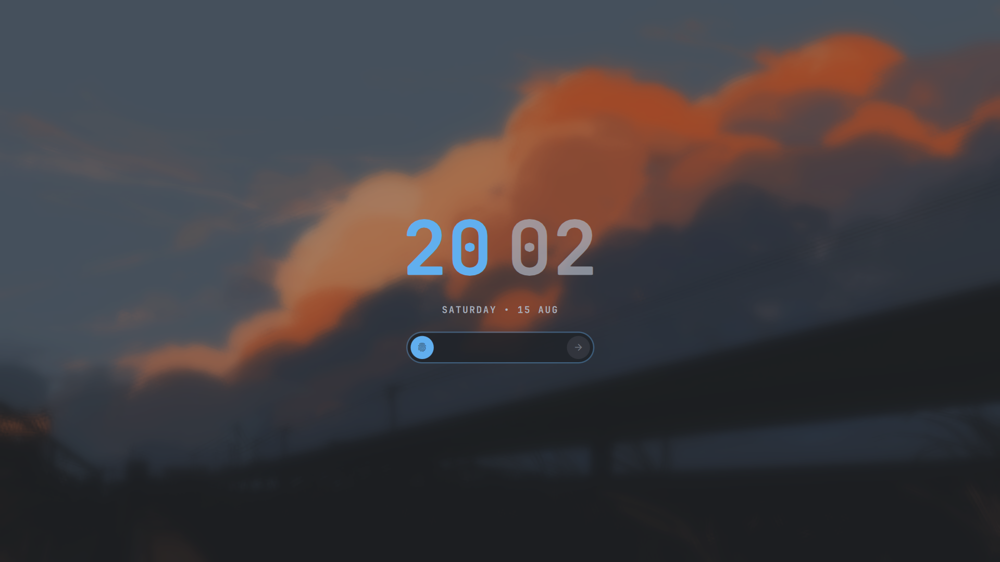

# Nova Lock


A drop-in replacement lock screen for the [Omarchy](https://omarchy.org/) Quickshell shell.

Split two-tone clock, profile picture, and a pill password field with per-character
dots. Every colour is read from Omarchy's `Color` singleton, so the lock face follows
whatever theme `omarchy theme set` last applied.

## Install

```bash
omarchy plugin disable omarchy.lock
omarchy plugin add https://github.com/thomas-roth/nova-lock.git --enable
```

Disable the stock lock first: both plugins register the same `lock` IPC target, and
the second one to register is ignored, so `omarchy system lock` would still reach
whichever won the race.

## Preview without locking

```bash
omarchy-shell lock preview      # click anywhere to dismiss
omarchy-shell lock hidePreview
```

## Update

```bash
omarchy plugin update io.github.dkgamer02ai.lock
omarchy restart shell
```

A restart is required after any change to the plugin's QML: `rescanPlugins` picks up
new plugins but does not drop Quickshell's cache of already-loaded QML.

## Uninstall

```bash
omarchy plugin remove io.github.dkgamer02ai.lock
omarchy plugin enable omarchy.lock
```

## Notes

`Service.qml` is Omarchy's stock lock service, unchanged: PAM password and fingerprint
flows, `WlSessionLock`, idle blanking and the `lock` IPC handler all behave exactly as
they do on stock. Only `LockView.qml` — the presentation layer — is this project's.

It is a *copy*, not a reference: `omarchy-plugin-validate` rejects symlinks inside a
plugin folder, so there is no way to point at the original. A copy goes stale as soon
as Omarchy patches the service upstream. To keep them in step automatically:

```bash
omarchy hook install post-update \
  ~/.config/omarchy/plugins/io.github.dkgamer02ai.lock/hooks/nova-lock-sync-service.sh
```

`omarchy plugin add` never runs anything from a repo, so this is a separate opt-in
step — skip it and the plugin still works, it just won't track upstream on its own.

The hook re-copies the stock service after every `omarchy update`, but only when the
two actually differ. The copy lands in this git worktree, so it shows up as a normal
diff to review and commit rather than changing under you. Restart the shell afterwards.

Check by hand any time:

```bash
diff /usr/share/omarchy/shell/plugins/lock/Service.qml \
     ~/.config/omarchy/plugins/io.github.dkgamer02ai.lock/Service.qml
```

Tunable knobs live at the top of `LockView.qml`: `clockFontSize`, `centerWidth`,
`avatarSize`, `fieldHeight`, `dotSize`.

## Licence

MIT
